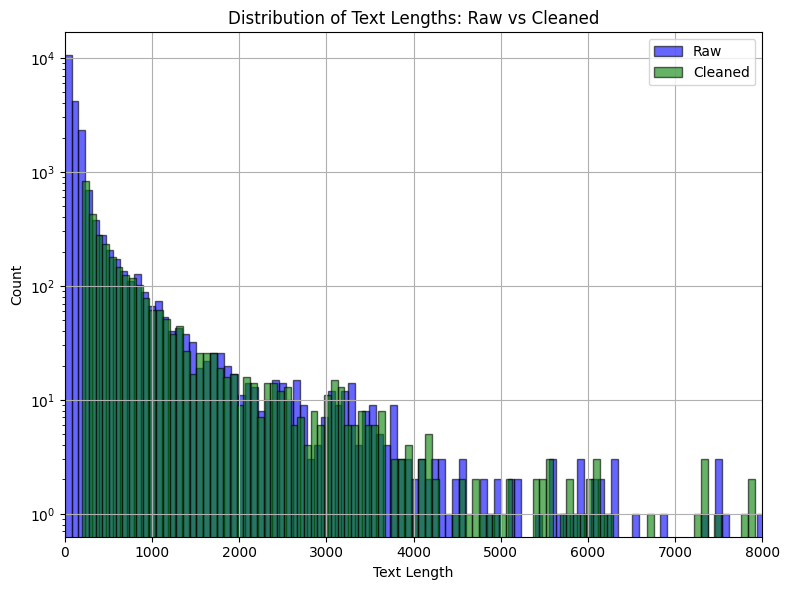
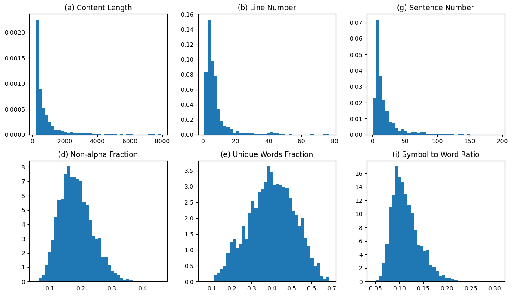

#  数据预处理与清洗策略

为了提升语料质量，我们在预处理后的文本上应用了一系列启发式清洗规则，特别针对 Wikipedia 数据中的冗余、无效、乱码或格式不规范内容进行了以下清理操作：


## 基础过滤规则（过滤整段无效文本）

1. **长度过滤**

   * 仅保留长度在 `200～8000` 字符之间的文本，太短的信息量不足，太长则可能是拼接或抽取错误。
2. **重定向过滤**

   * 跳过包含 `#REDIRECT` 或 `#重定向` 的段落，避免收录页面跳转的无效信息。


## 语言清理与转换

3. **语言选择模板处理**

   * 对 Wikipedia 中的多语言语法（如：`-{zh-cn: 简体; zh-tw: 繁體}-`）进行处理，仅保留简体中文部分。

4. **繁转简（OpenCC）**

   * 使用 `OpenCC` 工具将繁体中文统一转换为简体中文。


## 结构与格式冗余清理

5. **多余空行合并**

   * 多个连续换行被压缩为单个换行，避免段落结构错乱。

6. **无意义括号内容剔除**

   * 删除括号内明显为英文标注、外语名、缩写、乱码的内容，例如： `(Latin name)`, `（德语：XYZ）`, `（,缩写:EUVE）`
   * 保留有中文实义的部分，例如“（导演）”等。

7. **清除乱码和标点开头的括号内容**

   * 例如：`（，缩写：ABC）` → `""`

## 噪声与标题过滤

8. **无效标题/短句过滤**

   * 若某一行字数 ≤ 15 且无完整句子结构（如未包含句号、逗号等标点），将其视为无意义标题（如“外部链接”、“参考文献”等）并删除。

##  英文比例过滤

9. **以英文为主的句子过滤**

   * 对于英文字符显著多于中文字符（比例 > 70% 或英文数值是中文 2 倍以上）且无实质中文信息的句子，判断为结构噪声并移除。


---

## 示例清洗前后对比

原始文本：

```
- {zh-cn:国际奥委会; zh-tw:國際奧林匹克委員會}（International Olympic Committee, IOC）是……
```

清洗后：

```
国际奥委会是……
```
---

## 数据分析：
#### 清洗前后文本长度分布对比

下图展示了对 20,000 条原始中文维基段落进行清洗前后的文本长度分布对比（仅绘制了长度为0-8000）。
<div align="center">
  
</div>

* **柱状图说明：**
  蓝色为原始数据（Raw），绿色为清洗后的数据（Cleaned）。纵轴为每个长度段落的计数（对数坐标），横轴为文本长度（字数）。可以明显看出：

  * 原始数据中，大量段落集中在 0–500 字范围；
  * 清洗后，低于 200 字的短文本被有效过滤，突出了语料的内容密度；
  * 同时，大于 8000 字的异常长文本也被排除，仅保留结构合理的段落；
  * 清洗后段落整体更集中于 500–2500 字区间，长度更合理、内容更聚焦。

* **清洗标准回顾：**

  * **长度限制**：清洗保留了 200–8000 字之间的段落，排除了内容过短或可能格式异常、篇章混乱的段落；
  * **保留比例**：在 20,000 条原始段落中，清洗后剩余 3213 条满足长度要求；
  * **超长文本**：有 20 条样本超过 8000 字，被认为存在格式粘连或嵌套异常，因此未被保留。

* **补充观察：**
    * 清洗后文本平均长度显著减小，这表明原始维基数据中存在大量格式、引用、分类标记等与正文无关的内容；
    * 该图验证了启发式长度过滤策略在提升文本结构性和信息密度方面的实际效果。


你可以这样描述这张图，它展示了你清洗语料过程中用来评估文本质量的一些关键统计特征：


#### 清洗后语料统计特征分析

为了进一步评估清洗后的维基段落质量，我们对其基本文本统计特征进行了可视化分析。下图展示了六种重要分布：

<div align="center">
  
</div>


**图中六项特征依次为：**

1. **(a) Content Length：文本总长度（字数）**

   * 呈现长尾分布，主要在 200–1500 字之间；
   * 个别段落超过 4000 字，需关注是否存在拼接问题；
   * 相比原始语料，短文本被有效剔除，整体质量更均衡。

2. **(b) Line Number：段落中行数**

   * 大部分段落在 1–20 行之间；
   * 存在线数极多的少数文本，可能仍含模板或列表等结构，应作为后续异常检测候选。

3. **(g) Sentence Number：句子数**

   * 绝大多数段落包含 1-40 个句子；
   * 超过 50 句的段落较少，但可能表示较长段落或语法分句标注有误。

4. **(d) Non-alpha Fraction：非字母（符号/数字）占比**

   * 峰值在 0.1–0.3 之间，说明中文维基段落中非字母内容占比适中；
   * 超过 0.3 的段落比例很低，显示清洗后模板信息（如目录、引用链接）已基本剔除。

5. **(e) Unique Words Fraction：不重复词占比**

   * 呈现接近正态分布，主峰约在 0.4；
   * 表明文本冗余较低，词汇重复度适中，有利于训练模型学习多样化语言结构。

6. **(i) Symbol to Word Ratio：符号与单词比**

   * 主峰出现在 0.08–0.15；
   * 过高值表明可能存在代码段、公式、链接等结构，但在清洗后比例已显著降低。
  
(raw数据中，长度小于50的正文占比过重，影响特征分析，故不做对比)